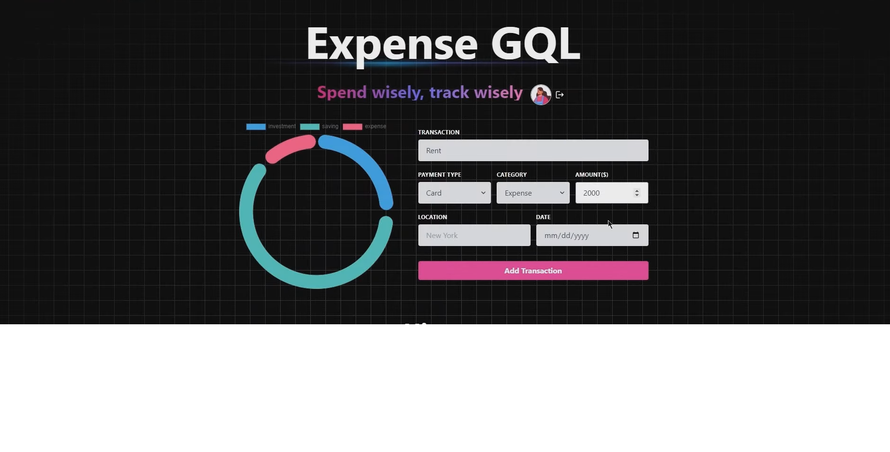

# 💰ExpenseGQL Buddy - Expense Tracker App💰

<div align="center">
  <br />
    <a>
      
    </a>
  <br />

  <div>
    
    
    
    
    
    
    

  </div>
  
</div>

## 📋 <a name="table">Table of Contents</a>

1. 🤖 [Introduction](#introduction)
2. ⚙️ [Tech Stack](#tech-stack)
3. 🔋 [Features](#features)
4. 🤸 [Quick Start](#quick-start)
5. 🕸️ [Snippets](#snippets)
6. 🔗 [Links](#links)


## <a name="introduction">🤖 Introduction</a>

The ExpenseBuddy is a comprehensive solution built with the MERN stack (MongoDB, Express.js, React.js, Node.js) and Apollo GraphQL, designed to help users manage their finances effectively. The app features a user-friendly interface with capabilities for tracking expenses, categorizing transactions, and generating financial reports. With advanced filtering options, pagination, and server-side rendering, the platform ensures a smooth and responsive user experience, optimized for performance and accessibility.

## <a name="tech-stack">⚙️ Tech Stack</a>

- **MongoDB** - Serves as the database for storing user data, including expenses, categories, and transaction details.
- **Express.js** - Provides a robust backend framework for handling API requests and server-side logic, ensuring efficient data processing.
- **React** - Powers the dynamic and interactive components of the user interface, enhancing the overall user experience.
- **Node.js** - Facilitates the backend environment, supporting server-side operations and real-time data handling.
- **Apollo GraphQL** - Manages data fetching and state management, offering a flexible API layer with robust querying capabilities.
- **Passport.js** - Implements secure authentication and session management, ensuring user data protection and secure access.
- **Render** - A platform for deploying the application, simplifying hosting and scaling processes.
- **Cron Jobs** - Automates scheduled tasks, such as generating periodic financial reports or reminders, to enhance user convenience.
- **TypeScript** - Ensures robust typing, improving code quality, maintainability, and developer productivity.

## <a name="features">🔋 Features</a>

📝 **GraphQL Schema and Resolvers**
Defines data structures and logic for querying and modifying the database, ensuring efficient data management. This setup provides a clear and structured way to interact with the data layer.

🔄 **Mutations and Graph Relations**
Allows modifications of database data, such as adding or updating transactions, while establishing relationships between data entities like expenses and categories. This organization aids in seamless data retrieval and management.

🎃 **Authentication with Passport.js**
Provides secure user authentication using Passport.js, with session management via MongoDB. It supports various strategies for secure and flexible access control.

🚀 **Global State Management with Apollo Client**
Manages global state and data synchronization between the client and server, ensuring the user interface reflects real-time data. Apollo Client enhances data management and performance.

🐞 **Error Handling**
Includes robust error handling mechanisms on both server and client sides, ensuring issues are managed effectively and user feedback is clear. This improves the app's reliability and usability.

⭐ **Deployment with Render**
Deploys the app using Render, offering easy scalability, monitoring, and CI/CD support. Render ensures that the app remains accessible and performant.

👾 **Cron Jobs for Scheduled Tasks**
Automates tasks like sending reports or clearing old data, enhancing functionality and user convenience. Cron jobs ensure timely execution of routine processes.

⏳ **And Much More!**

## <a name="quick-start">🤸 Quick Start Installation</a>

Follow these steps to set up the project locally on your machine.

**Prerequisites**

Make sure you have the following installed on your machine:

- [Git](https://git-scm.com/)
- [Node.js](https://nodejs.org/en)
- [npm](https://www.npmjs.com/) (Node Package Manager)

**Cloning the Repository**

```bash
git clone https://github.com/RayMoham/Car_Hub-Website.git
cd project_next_car_showcase
```

**Installation**

Install the project dependencies using npm:

```bash
npm install
```

**Set Up Environment Variables**

Create a new file named `.env` in the root of your project and add the following content:

```env
NEXT_PUBLIC_RAPID_API_KEY=
NEXT_PUBLIC_IMAGIN_API_KEY=hrjavascript-mastery
```

Replace the placeholder values with your actual credentials. You can obtain these credentials by signing up on the corresponding websites from [Rapid API](https://www.youtube.com/redirect?event=video_description&redir_token=QUFFLUhqbmI1TlE1NHFGZ1JLdHU3dnAxSTU5a2R5UUM4QXxBQ3Jtc0tsUDY0aW8xMFhUZVdxMUNzSUlKUExRTG5UaDZoR3hWVFprN2tJV0k2dnk4MXo2NVFMVkk0NWhGS19Nd0g5cGRfN2JjcTdaSlJJRHJKYzlfT3lSS1M4TDVNVTV5Wl91c1lIR2VPZUYzbHJ2Tll2QkJ0aw&q=https%3A%2F%2Frapidapi.com%2Fapininjas%2Fapi%2Fcars-by-api-ninjas%3Futm_source%3Dyoutube.com%2FJavaScriptMastery%26utm_medium%3Dreferral%26utm_campaign%3DDevRel&v=pUNSHPyVryU) to [Imagin Cars](https://www.imagin.studio/solutions/api)

**Running the Project**

```bash
npm run dev
```

Open [http://localhost:3000](http://localhost:3000) in your browser to view the project.

## <a name="snippets">🕸️ Snippets</a>

<details>
<summary><code>constants.ts</code></summary>

```typescript
export const manufacturers = [
  "Acura",
  "Alfa Romeo",
  "Aston Martin",
  "Audi",
  "Bentley",
  "BMW",
  "Buick",
  "Cadillac",
  "Chevrolet",
  "Chrysler",
  "Citroen",
  "Dodge",
  "Ferrari",
  "Fiat",
  "Ford",
  "GMC",
  "Honda",
  "Hyundai",
  "Infiniti",
  "Jaguar",
  "Jeep",
  "Kia",
  "Lamborghini",
  "Land Rover",
  "Lexus",
  "Lincoln",
  "Maserati",
  "Mazda",
  "McLaren",
  "Mercedes-Benz",
  "MINI",
  "Mitsubishi",
  "Nissan",
  "Porsche",
  "Ram",
  "Rolls-Royce",
  "Subaru",
  "Tesla",
  "Toyota",
  "Volkswagen",
  "Volvo",
];

export const yearsOfProduction = [
  { title: "Year", value: "" },
  { title: "2015", value: "2015" },
  { title: "2016", value: "2016" },
  { title: "2017", value: "2017" },
  { title: "2018", value: "2018" },
  { title: "2019", value: "2019" },
  { title: "2020", value: "2020" },
  { title: "2021", value: "2021" },
  { title: "2022", value: "2022" },
  { title: "2023", value: "2023" },
];

export const fuels = [
  {
    title: "Fuel",
    value: "",
  },
  {
    title: "Gas",
    value: "Gas",
  },
  {
    title: "Electricity",
    value: "Electricity",
  },
];

export const footerLinks = [
  {
    title: "About",
    links: [
      { title: "How it works", url: "/" },
      { title: "Featured", url: "/" },
      { title: "Partnership", url: "/" },
      { title: "Bussiness Relation", url: "/" },
    ],
  },
  {
    title: "Company",
    links: [
      { title: "Events", url: "/" },
      { title: "Blog", url: "/" },
      { title: "Podcast", url: "/" },
      { title: "Invite a friend", url: "/" },
    ],
  },
  {
    title: "Socials",
    links: [
      { title: "Discord", url: "/" },
      { title: "Instagram", url: "/" },
      { title: "Twitter", url: "/" },
      { title: "Facebook", url: "/" },
    ],
  },
];
```

</details>

<details>
<summary><code>globals.css</code></summary>

```css
@import url("https://fonts.googleapis.com/css2?family=Manrope:wght@200;300;400;500;600;700;800&display=swap");

@tailwind base;
@tailwind components;
@tailwind utilities;

* {
  margin: 0;
  padding: 0;
  box-sizing: border-box;
  font-family: "Manrope", sans-serif;
}

/* START: General styles */
.max-width {
  @apply max-w-[1440px] mx-auto;
}

.padding-x {
  @apply sm:px-16 px-6;
}

.padding-y {
  @apply py-4;
}

.flex-center {
  @apply flex items-center justify-center;
}

.flex-between {
  @apply flex justify-between items-center;
}

.custom-btn {
  @apply flex flex-row relative justify-center items-center py-3 px-6 outline-none;
}
/* END: General styles */

/* START: Hero styles */
.hero {
  @apply flex xl:flex-row flex-col gap-5 relative z-0 max-w-[1440px] mx-auto;
}

.hero__title {
  @apply 2xl:text-[72px] sm:text-[64px] text-[50px] font-extrabold;
}

.hero__subtitle {
  @apply text-[27px] text-black-100 font-light mt-5;
}

.hero__image-container {
  @apply xl:flex-[1.5] flex justify-end items-end w-full xl:h-screen;
}

.hero__image {
  @apply relative xl:w-full w-[90%] xl:h-full h-[590px] z-0;
}

.hero__image-overlay {
  @apply absolute xl:-top-24 xl:-right-1/2 -right-1/4 bg-hero-bg bg-repeat-round -z-10 w-full xl:h-screen h-[590px] overflow-hidden;
}
/* END: Hero styles */

/* START: Home styles */

.home__text-container {
  @apply flex flex-col items-start justify-start gap-y-2.5 text-black-100;
}

.home__filters {
  @apply mt-12 w-full flex-between items-center flex-wrap gap-5;
}

.home__filter-container {
  @apply flex justify-start flex-wrap items-center gap-2;
}

.home__cars-wrapper {
  @apply grid 2xl:grid-cols-4 xl:grid-cols-3 md:grid-cols-2 grid-cols-1 w-full gap-8 pt-14;
}

.home__error-container {
  @apply mt-16 flex justify-center items-center flex-col gap-2;
}
/* END: Home styles */

/* START: Car Card styles */
.car-card {
  @apply flex flex-col p-6 justify-center items-start text-black-100 bg-primary-blue-100 hover:bg-white hover:shadow-md rounded-3xl;
}

.car-card__content {
  @apply w-full flex justify-between items-start gap-2;
}

.car-card__content-title {
  @apply text-[22px] leading-[26px] font-bold capitalize;
}

.car-card__price {
  @apply flex mt-6 text-[32px] leading-[38px] font-extrabold;
}

.car-card__price-dollar {
  @apply self-start text-[14px] leading-[17px] font-semibold;
}

.car-card__price-day {
  @apply self-end text-[14px] leading-[17px] font-medium;
}

.car-card__image {
  @apply relative w-full h-40 my-3 object-contain;
}

.car-card__icon-container {
  @apply flex group-hover:invisible w-full justify-between text-grey;
}

.car-card__icon {
  @apply flex flex-col justify-center items-center gap-2;
}

.car-card__icon-text {
  @apply text-[14px] leading-[17px];
}

.car-card__btn-container {
  @apply hidden group-hover:flex absolute bottom-0 w-full z-10;
}
/* END: Car Card styles */

/* START: Car Details styles */
.car-details__dialog-panel {
  @apply relative w-full max-w-lg max-h-[90vh] overflow-y-auto transform rounded-2xl bg-white p-6 text-left shadow-xl transition-all flex flex-col gap-5;
}

.car-details__close-btn {
  @apply absolute top-2 right-2 z-10 w-fit p-2 bg-primary-blue-100 rounded-full;
}

.car-details__main-image {
  @apply relative w-full h-40 bg-pattern bg-cover bg-center rounded-lg;
}
/* END: Car Details styles */

/* START: Custom Filter styles */
.custom-filter__btn {
  @apply relative w-full min-w-[127px] flex justify-between items-center cursor-default rounded-lg bg-white py-2 px-3 text-left shadow-md sm:text-sm border;
}

.custom-filter__options {
  @apply absolute mt-1 max-h-60 w-full overflow-auto rounded-md bg-white py-1 text-base shadow-lg ring-1 ring-black ring-opacity-5 focus:outline-none sm:text-sm;
}
/* END: Custom Filter styles */

/* START: Footer styles */
.footer {
  @apply flex flex-col text-black-100  mt-5 border-t border-gray-100;
}

.footer__links-container {
  @apply flex max-md:flex-col flex-wrap justify-between gap-5 sm:px-16 px-6 py-10;
}

.footer__rights {
  @apply flex flex-col justify-start items-start gap-6;
}

.footer__links {
  @apply flex-1 w-full flex md:justify-end flex-wrap max-md:mt-10 gap-20;
}

.footer__link {
  @apply flex flex-col gap-6 text-base min-w-[170px];
}

.footer__copyrights {
  @apply flex justify-between items-center flex-wrap mt-10 border-t border-gray-100 sm:px-16 px-6 py-10;
}

.footer__copyrights-link {
  @apply flex-1 flex sm:justify-end justify-center max-sm:mt-4 gap-10;
}
/* END: Footer styles */

/* START: searchbar styles */
.searchbar {
  @apply flex items-center justify-start max-sm:flex-col w-full relative max-sm:gap-4 max-w-3xl;
}

.searchbar__item {
  @apply flex-1 max-sm:w-full flex justify-start items-center relative;
}

.searchbar__input {
  @apply w-full h-[48px] pl-12 p-4 bg-light-white rounded-r-full max-sm:rounded-full outline-none cursor-pointer text-sm;
}
/* END: searchbar styles */

/* START: search manufacturer styles */
.search-manufacturer {
  @apply flex-1 max-sm:w-full flex justify-start items-center;
}

.search-manufacturer__input {
  @apply w-full h-[48px] pl-12 p-4 rounded-l-full max-sm:rounded-full bg-light-white outline-none cursor-pointer text-sm;
}

.search-manufacturer__options {
  @apply absolute mt-1 max-h-60 w-full overflow-auto rounded-md bg-white py-1 text-base shadow-lg ring-1 ring-black ring-opacity-5 focus:outline-none sm:text-sm;
}

.search-manufacturer__option {
  @apply cursor-default select-none py-2 pl-10 pr-4;
}
/* END: search manufacturer styles */
```

</details>

<details>
<summary><code>tailwind.config.js</code></summary>

```javascript
/** @type {import('tailwindcss').Config} */
module.exports = {
  content: [
    "./pages/**/*.{js,ts,jsx,tsx,mdx}",
    "./components/**/*.{js,ts,jsx,tsx,mdx}",
    "./app/**/*.{js,ts,jsx,tsx,mdx}",
  ],
  mode: "jit",
  theme: {
    extend: {
      fontFamily: {
        inter: ["Inter", "sans-serif"],
      },
      colors: {
        "black-100": "#2B2C35",
        "primary-blue": {
          DEFAULT: "#2B59FF",
          100: "#F5F8FF",
        },
        "secondary-orange": "#f79761",
        "light-white": {
          DEFAULT: "rgba(59,60,152,0.03)",
          100: "rgba(59,60,152,0.02)",
        },
        grey: "#747A88",
      },
      backgroundImage: {
        'pattern': "url('/pattern.png')",
        'hero-bg': "url('/hero-bg.png')"
      }
    },
  },
  plugins: [],
};
```

</details>

## <a name="links">🔗 Links & Visuals</a>

Assets used in the project are [here](https://drive.google.com/file/d/1Ague8aTHA6JSrzy3kscEZmrJQdtDxqwy/view)

<div align="center">
  <br />
    <a>
      
      
    </a>
  <br />

Contributing
------------

If you would like to contribute to the project, feel free to submit a pull request. Please ensure that your changes are in line with the project's coding standards and practices.

License
-------

This project is open-source and available under the [MIT License](https://chat.openai.com/LICENSE).


## Features:

-   🌟 Tech stack: MERN (MongoDB, Express.js, React.js, Node.js) + Apollo GraphQL
-   📝 Learn type definitions and resolvers for defining GraphQL schema and data fetching logic
-   🔄 Mutations for modifying data in the GraphQL API and establishing graph relations
-   🎃 Authentication with Passport.js and MongoDB session store
-   🚀 Global state management with Apollo Client
-   🐞 Error handling both on the server and on the client
-   ⭐ Deployment made easy with a platform called Render
-   👾 Cron jobs for scheduled tasks and automation
-   ⏳ And much more!

### Setup .env file

```js
MONGO_URI=...
SESSION_SECRET=...
```

### Build the app

```shell
npm run build
```

### Start the app

```shell
npm start
```
