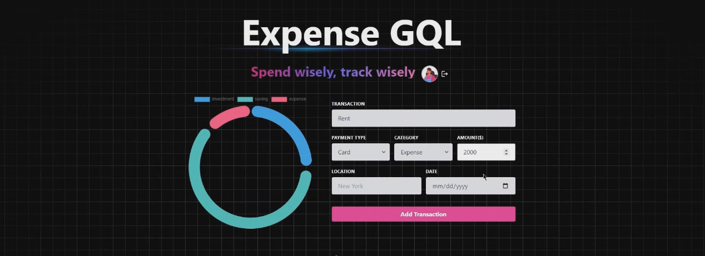

# 💰ExpenseGQL Buddy - Expense Tracker App💰

<div align="center">
  <br />
    <a>
      
    </a>
  <br />

  <div>
    
    
    
    
    
    
    

  </div>
  
</div>

## 📋 <a name="table">Table of Contents</a>

1. 🤖 [Introduction](#introduction)
2. ⚙️ [Tech Stack](#tech-stack)
3. 🔋 [Features](#features)
4. 🤸 [Quick Start](#quick-start)


## <a name="introduction">🤖 Introduction</a>

The ExpenseBuddy is a comprehensive solution built with the MERN stack (MongoDB, Express.js, React.js, Node.js) and Apollo GraphQL, designed to help users manage their finances effectively. The app features a user-friendly interface with capabilities for tracking expenses, categorizing transactions, and generating financial reports. With advanced filtering options, pagination, and server-side rendering, the platform ensures a smooth and responsive user experience, optimized for performance and accessibility.

## <a name="tech-stack">⚙️ Tech Stack</a>

- **MongoDB** - Serves as the database for storing user data, including expenses, categories, and transaction details.
- **Express.js** - Provides a robust backend framework for handling API requests and server-side logic, ensuring efficient data processing.
- **React** - Powers the dynamic and interactive components of the user interface, enhancing the overall user experience.
- **Node.js** - Facilitates the backend environment, supporting server-side operations and real-time data handling.
- **Apollo GraphQL** - Manages data fetching and state management, offering a flexible API layer with robust querying capabilities.
- **Passport.js** - Implements secure authentication and session management, ensuring user data protection and secure access.
- **Render** - A platform for deploying the application, simplifying hosting and scaling processes.
- **Cron Jobs** - Automates scheduled tasks, such as generating periodic financial reports or reminders, to enhance user convenience.
- **TypeScript** - Ensures robust typing, improving code quality, maintainability, and developer productivity.

## <a name="features">🔋 Features</a>

📝 **GraphQL Schema and Resolvers**
Defines data structures and logic for querying and modifying the database, ensuring efficient data management. This setup provides a clear and structured way to interact with the data layer.

🔄 **Mutations and Graph Relations**
Allows modifications of database data, such as adding or updating transactions, while establishing relationships between data entities like expenses and categories. This organization aids in seamless data retrieval and management.

🎃 **Authentication with Passport.js**
Provides secure user authentication using Passport.js, with session management via MongoDB. It supports various strategies for secure and flexible access control.

🚀 **Global State Management with Apollo Client**
Manages global state and data synchronization between the client and server, ensuring the user interface reflects real-time data. Apollo Client enhances data management and performance.

🐞 **Error Handling**
Includes robust error handling mechanisms on both server and client sides, ensuring issues are managed effectively and user feedback is clear. This improves the app's reliability and usability.

⭐ **Deployment with Render**
Deploys the app using Render, offering easy scalability, monitoring, and CI/CD support. Render ensures that the app remains accessible and performant.

👾 **Cron Jobs for Scheduled Tasks**
Automates tasks like sending reports or clearing old data, enhancing functionality and user convenience. Cron jobs ensure timely execution of routine processes.

⏳ **And Much More!**

## <a name="quick-start">🤸 Quick Start Installation</a>

Follow these steps to set up the project locally on your machine.

**Prerequisites**

Make sure you have the following installed on your machine:

- [Git](https://git-scm.com/)
- [Node.js](https://nodejs.org/en)
- [npm](https://www.npmjs.com/) (Node Package Manager)

**Cloning the Repository**

```bash
git clone https://github.com/RayMoham/ExpenseGQL-Buddy.git
cd ExpenseTracker
```

**Installation**

Install the project dependencies using npm:

```bash
npm install
```

**Set Up Environment Variables**

Create a new file named `.env` in the root of your project and add the following content:

```env
MONGO_URI=...
SESSION_SECRET=...
```

Replace the placeholder values with your actual credentials. You can obtain these credentials by signing up for the corresponding websites on [MongoDB](https://www.mongodb.com/),[Render](https://render.com/)

### Build the app

```shell
npm run build
```

### Start the app

```shell
npm start
```

Contributing
------------

If you would like to contribute to the project, feel free to submit a pull request. Please ensure that your changes are in line with the project's coding standards and practices.

License
-------

This project is open-source and available under the [MIT License](https://chat.openai.com/LICENSE).


